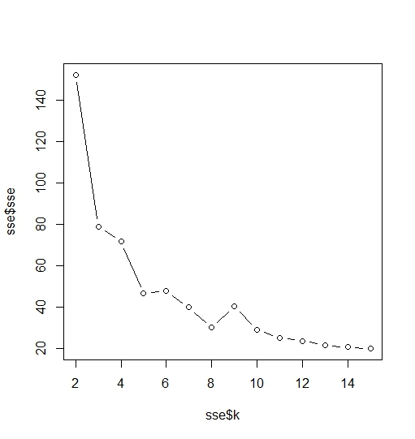

R Markdown
----------

Elbow algorithm. Useful to see how many clusters there are in the data.

Code Source: How to decide the value of K in data
<http://r-posts.com/exploring-assumptions-of-k-means-clustering-using-r/#comment-82>

    data(iris, package = 'datasets')
    attach(iris)

    str(iris)

    ## 'data.frame':    150 obs. of  5 variables:
    ##  $ Sepal.Length: num  5.1 4.9 4.7 4.6 5 5.4 4.6 5 4.4 4.9 ...
    ##  $ Sepal.Width : num  3.5 3 3.2 3.1 3.6 3.9 3.4 3.4 2.9 3.1 ...
    ##  $ Petal.Length: num  1.4 1.4 1.3 1.5 1.4 1.7 1.4 1.5 1.4 1.5 ...
    ##  $ Petal.Width : num  0.2 0.2 0.2 0.2 0.2 0.4 0.3 0.2 0.2 0.1 ...
    ##  $ Species     : Factor w/ 3 levels "setosa","versicolor",..: 1 1 1 1 1 1 1 1 1 1 ...

    sse <- vector('numeric')
    for(i in 2:15){
      #k-means function in R has a feature withinss which stores sse for each cluster group
      sse[i-1]=sum(kmeans(iris[,1:4],centers = i)$withinss)
    }
    #Converting the sse to a data frame and storing corresponding value of k
    sse <- as.data.frame(sse)
    sse$k = seq.int(2,15)

Including Plots
---------------

Where you see the elbow that is the ideal number of clustering in the
data:

