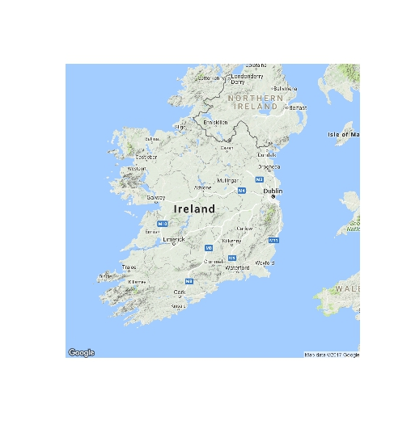
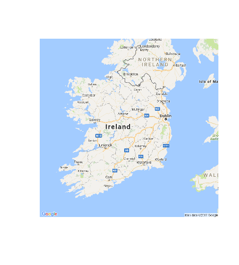
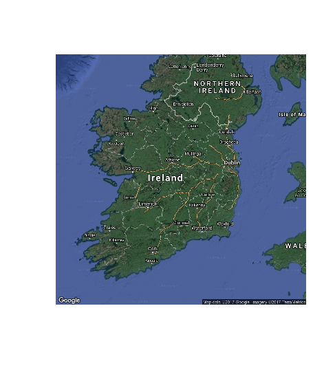
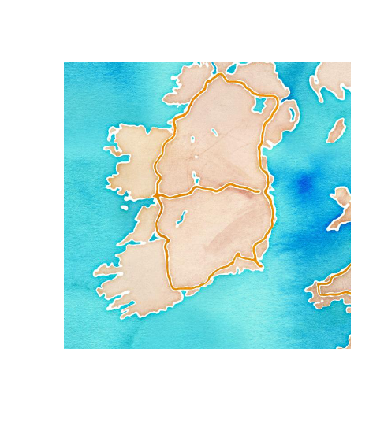
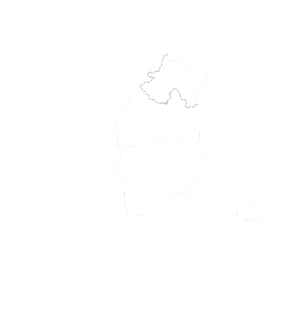
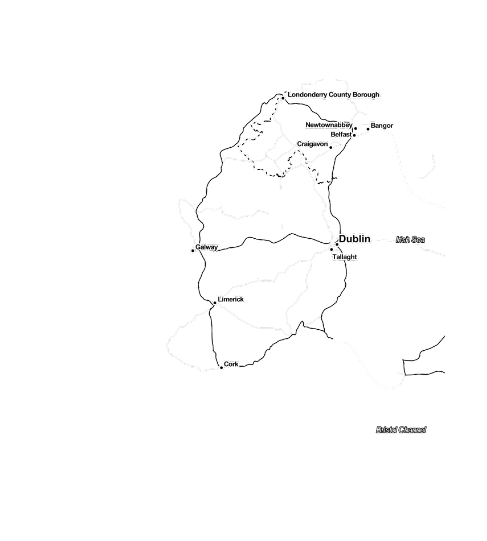
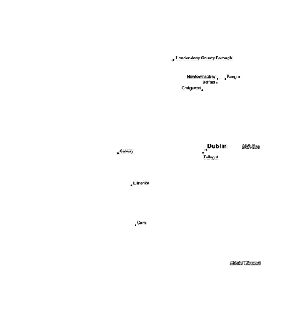
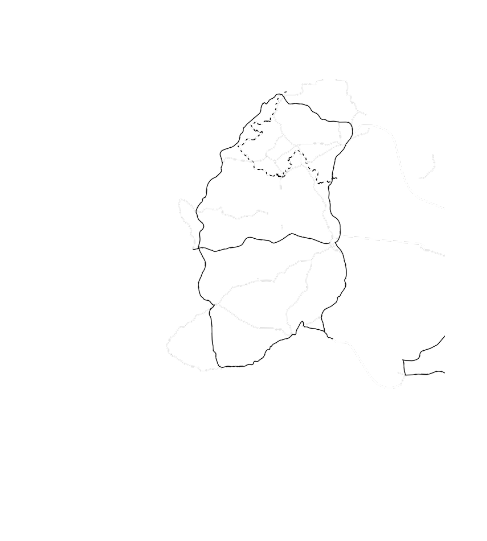
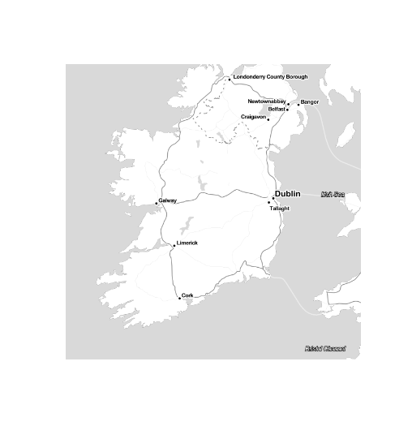

Maps in R
---------

Aim of this document is to show all the possible maps that are available
in R

Terrain
-------

    library(ggmap)
    Ireland1 <- get_map(location = 'Ireland', zoom = 7, maptype = "terrain")

Satellite
---------

    library(ggmap)
    Ireland3 <- get_map(location = 'Ireland', zoom = 7, maptype = "satellite")
    
   

Roadmap
-------

    library(ggmap)
    Ireland4 <- get_map(location = 'Ireland', zoom = 7, maptype = "roadmap")
    

    
Hybrid
------

    library(ggmap)
    Ireland5 <- get_map(location = 'Ireland', zoom = 7, maptype = "hybrid")
    
   

Toner
-----

    library(ggmap)
    Ireland6 <- get_map(location = 'Ireland', zoom = 7, maptype = "toner", source = "stamen")
    
    

Water Color
-----------

    library(ggmap)
    Ireland7 <- get_map(location = 'Ireland', zoom = 7, maptype = "watercolor", source = "stamen")

Terrain-lines
-------------

    library(ggmap)
    Ireland9 <- get_map(location = 'Ireland', zoom = 7, maptype = "terrain-lines", source = "stamen")

Toner-2010
----------

    library(ggmap)
    Ireland10 <- get_map(location = 'Ireland', zoom = 7, maptype = "toner-2010", source = "stamen")
    

Toner-2011
----------

    library(ggmap)
    Ireland11 <- get_map(location = 'Ireland', zoom = 7, maptype = "toner-2011", source = "stamen")

    

Toner-background
----------------

    library(ggmap)
    Ireland12 <- get_map(location = 'Ireland', zoom = 7, maptype = "toner-background")

    

Toner-hybrid
------------

    library(ggmap)
    Ireland13 <- get_map(location = 'Ireland', zoom = 7, maptype = "toner-hybrid", source = "stamen")

Toner-labels
------------

    library(ggmap)
    Ireland14 <- get_map(location = 'Ireland', zoom = 7, maptype = "toner-labels", source = "stamen")

   

Toner-lines
-----------

    library(ggmap)
    Ireland15 <- get_map(location = 'Ireland', zoom = 7, maptype = "toner-lines", source = "stamen")

    

Toner-lite
----------
    
    library(ggmap)
    Ireland16 <- get_map(location = 'Ireland', zoom = 7, maptype = "toner-lite", source = "stamen")

